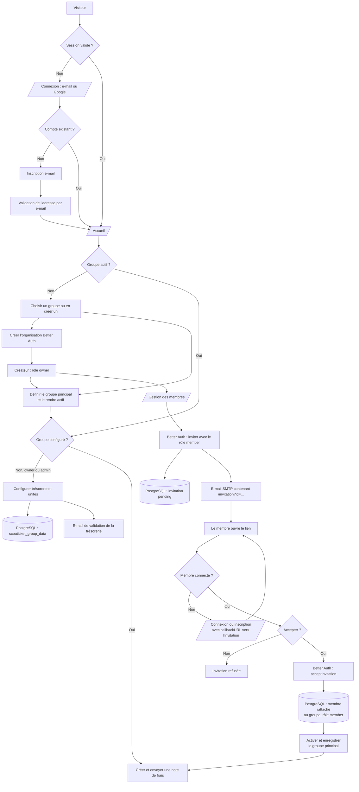
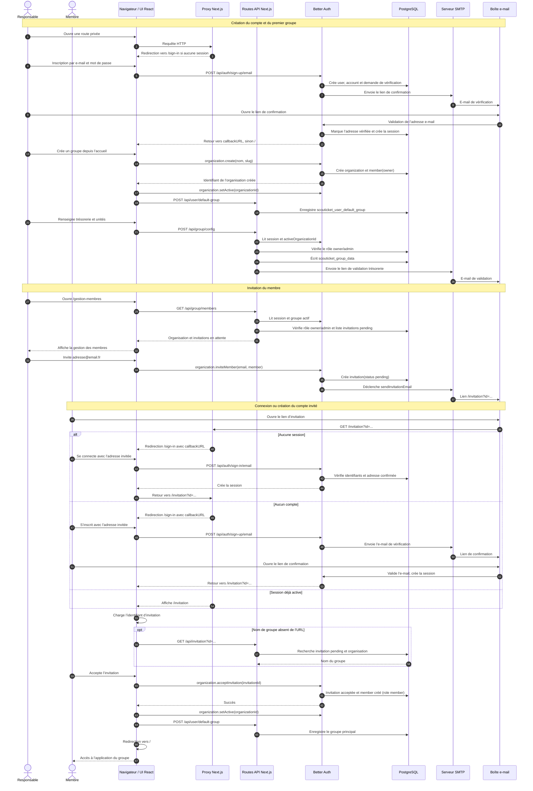

# Vue d’ensemble du projet

## Fonctionnalités principales

- Capture photo et import de justificatifs (images/PDF)
- Saisie guidée des informations de dépense
- Envoi automatique par email (trésorerie + utilisateur)
- Groupes indépendants : unités, couleurs et adresse de trésorerie propres à chaque groupe
- Validation de l’adresse de trésorerie avant le premier envoi
- Support PWA (installation écran d’accueil)
- Mode hors ligne partiel (préparation possible, envoi en ligne)

## Stack technique

- **Next.js 16** (App Router)
- **TypeScript**
- **Tailwind CSS**
- **Better Auth** pour l’authentification, les organisations et les invitations
- **SMTP / Nodemailer** pour l’envoi des emails

## Architecture simplifiée

## Séquence complète : compte, groupe et invitation

## Informations personnelles

L'application n'a pas de base de données persistante pour les justificatifs. Les pièces jointes sont transmises par e-mail et ne sont pas stockées par l’application.

Better Auth gère les comptes, les organisations, les rôles et les invitations. L’application stocke la configuration des groupes (adresse de trésorerie, unités et état de validation) dans PostgreSQL, dans `scouticket_group_data`.

La préférence de groupe principal est stockée séparément dans `scouticket_user_default_group`. Après l’acceptation d’une invitation, le groupe rejoint devient automatiquement le groupe actif et principal du membre.
